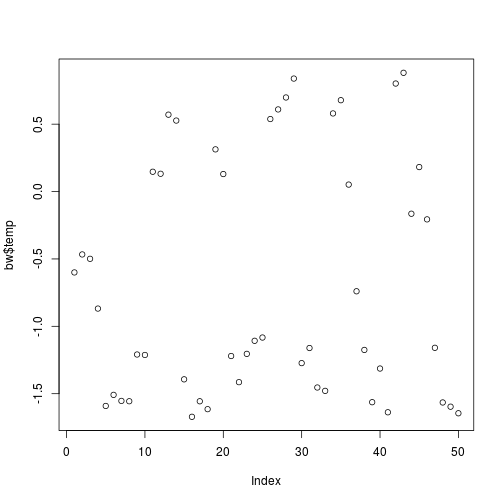
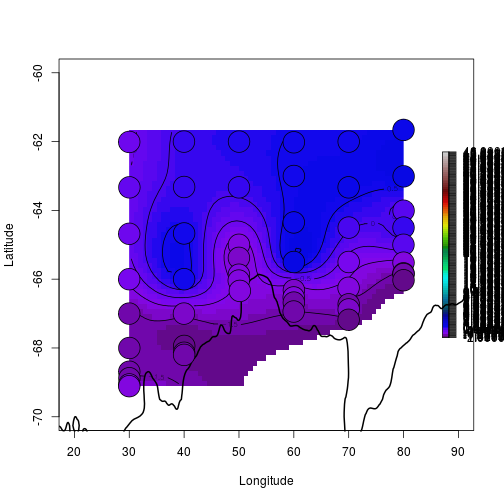
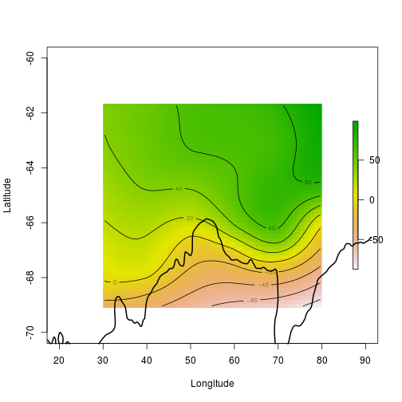
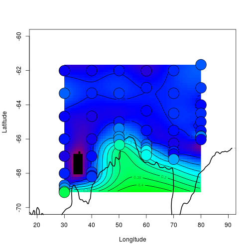

Get some bathymetric data and save it (see Appendix). 

Load the bathymetry data. 

```r
load("data/broke_bathy.RData")
```

Read the zooplankton data. 


```r
library(readxl)
bw <- read_excel("data/BW-Zooplankton_env.xls")
summary(bw[,1:10])
```

```
##     Station            Lat              Lon            depth     
##  Min.   :  4.00   Min.   :-69.11   Min.   :29.98   Min.   : 175  
##  1st Qu.: 37.25   1st Qu.:-66.84   1st Qu.:40.00   1st Qu.:1523  
##  Median : 60.00   Median :-65.84   Median :55.06   Median :3065  
##  Mean   : 64.36   Mean   :-65.46   Mean   :54.60   Mean   :2791  
##  3rd Qu.:100.25   3rd Qu.:-64.09   3rd Qu.:70.00   3rd Qu.:4114  
##  Max.   :122.00   Max.   :-61.66   Max.   :80.02   Max.   :5075  
##       temp              sal         chl a mg/m2)       ASC (km)      
##  Min.   :-1.6712   Min.   :33.93   Min.   : 29.60   Min.   :-39.600  
##  1st Qu.:-1.4726   1st Qu.:34.14   1st Qu.: 44.91   1st Qu.:  4.125  
##  Median :-1.1332   Median :34.25   Median : 53.00   Median :114.950  
##  Mean   :-0.6755   Mean   :34.22   Mean   : 76.80   Mean   :187.506  
##  3rd Qu.: 0.1435   3rd Qu.:34.31   3rd Qu.: 85.57   3rd Qu.:330.550  
##  Max.   : 0.8815   Max.   :34.42   Max.   :352.51   Max.   :775.500  
##  ice free days     Total abundance   
##  Min.   :-35.322   Min.   :   459.3  
##  1st Qu.:  6.108   1st Qu.:  4425.9  
##  Median : 33.153   Median : 11346.1  
##  Mean   : 33.139   Mean   : 23609.3  
##  3rd Qu.: 62.901   3rd Qu.: 27417.3  
##  Max.   :101.420   Max.   :116715.8
```

Plot the temperature data. 


```r
plot(bw$temp)
```

 

Create a grid to interpolate onto. 


```r
library(raster)
xy <- as.matrix(bw[, c("Lon", "Lat")])
r0 <-  raster(extent(xy), ncol = 60, nrow = 50, crs = "+proj=longlat +ellps=WGS84 +datum=WGS84 +no_defs +towgs84=0,0,0")
library(fields)
tps <- Tps(xy, bw$temp)
```

```
## Warning: 
## Grid searches over lambda (nugget and sill variances) with  minima at the endpoints: 
##   (GCV) Generalized Cross-Validation 
##    minimum at  right endpoint  lambda  =  3.169597e-06 (eff. df= 47.50002 
## )
```

```r
temp <- interpolate(r0, tps)
temp[temp < -1.8] <- NA_real_

tps <- Tps(xy, bw$`ice free days`)
ifd <- interpolate(r0, tps)

tps <- Tps(xy, bw$`chl a mg/m2)`/1000)
```

```
## Warning: 
## Grid searches over lambda (nugget and sill variances) with  minima at the endpoints: 
##   (GCV) Generalized Cross-Validation 
##    minimum at  right endpoint  lambda  =  3.169597e-06 (eff. df= 47.50002 
## )
```

```r
chl <- interpolate(r0, tps)

library(palr)
spal <- palr::sstPal(palette = TRUE)
plot(NA, asp = NA, xlab = "Longitude", ylab = "Latitude", xlim = c(20, 90), ylim = c(-70, -60))
plot(temp, add = TRUE, col = spal$cols, breaks = spal$breaks)
contour(temp, add = TRUE)
contour(bathy,  lwd = 2, lev = -1, add = TRUE); ##c(-5000, -4000, -3000, -500, -200))
points(xy, pch = 21, cex = 4, bg = sstPal(bw$temp))
```

 

```r
# use model to predict values at all locations
plot(NA, asp = NA, xlab = "Longitude", ylab = "Latitude", xlim = c(20, 90), ylim = c(-70, -60))
plot(ifd, add = TRUE)
contour(ifd, add = TRUE)
contour(bathy,  lwd = 2, lev = -1, add = TRUE); ##c(-5000, -4000, -3000, -500, -200))
```

 

```r
# use model to predict values at all locations
plot(NA, asp = NA, xlab = "Longitude", ylab = "Latitude", xlim = c(20, 90), ylim = c(-70, -60))
pal <- palr::chlPal(palette = TRUE)
plot(chl, add = TRUE, col = pal$cols, breaks = pal$breaks, legend = FALSE)
contour(chl, add = TRUE)
contour(bathy,  lwd = 2, lev = -1, add = TRUE); ##c(-5000, -4000, -3000, -500, -200))
points(xy, pch = 21, cex = 4, bg = chlPal(bw$`chl a mg/m2)`/1000))
```

 


# Appendix


```r
library(raadtools)
bathy1 <- aggregate(readtopo("etopo2", xylim = extent(15, 95, -75, -55)) , fact = 2, fun = mean)
gf <- focalWeight(bathy1, res(bathy1) * 6, "Gauss")
bathy <- focal(bathy1, gf)
save(bathy, file = "data/broke_bathy.RData")
```

